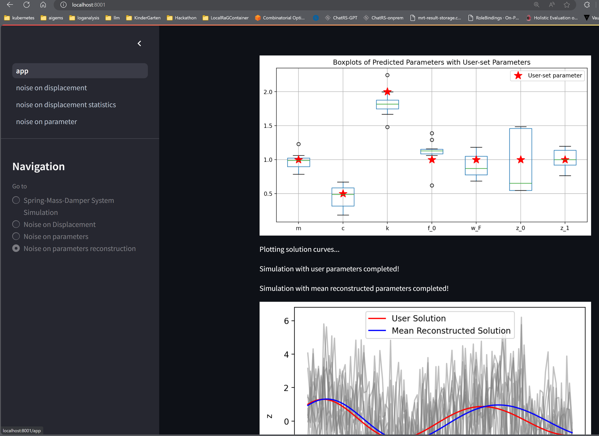

# Spring-Mass-Damper System Simulation
## Overview
This project simulates a Spring-Mass-Damper (SMD) system with noise integration. It features an asynchronous backend for efficient computation and a Streamlit frontend for interactive visualization.

## Features
- Spring-Mass-Damper Simulation: Models the dynamics of a spring-mass-damper system.
- Noise Integration: Adds noise to the simulation, affecting both displacement and system parameters for more accurate results.
- Parameter reconstruction: Usage of ML to reconstruct statistically parameters from given set of noisy measurements of a displacment.
  
- Asynchronous Backend: Utilizes asynchronous programming to enhance performance and responsiveness.
- Streamlit Frontend: Provides an interactive and user-friendly interface for visualizing the simulation results.
